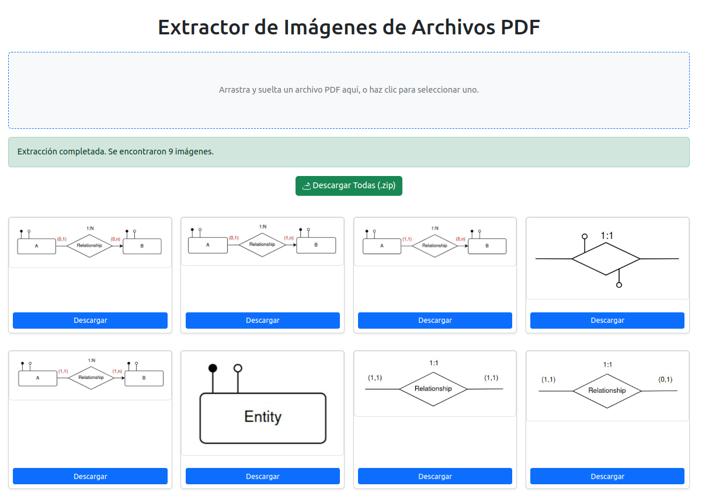

# PDF Image Extractor 🖼️

Una sencilla herramienta web para extraer imágenes de archivos PDF directamente en tu navegador. ¡Sube tu PDF y descarga las imágenes! ✨

## Captura de Pantalla 📸

## Demo en Vivo 🚀

Prueba la aplicación aquí: **[Live Demo](https://soyunomas.github.io/PDF-ImageExtract/index.html)**

## Características Principales 🎯

*   📂 **Carga Fácil de PDF:** Selecciona archivos mediante el explorador o arrastra y suelta (`drag & drop`).
*   🔍 **Extracción Automática:** Analiza el PDF y extrae las imágenes incrustadas.
*   🖼️ **Vista Previa:** Muestra miniaturas de todas las imágenes encontradas.
*   💾 **Descarga Individual:** Guarda cualquier imagen específica con un solo clic.
*   📦 **Descarga Múltiple:** Descarga todas las imágenes juntas en un archivo `.zip` conveniente.
*   💅 **Interfaz Clara:** Diseño limpio y responsivo gracias a Bootstrap.
*   ⚙️ **Procesamiento en el Navegador:** Todo el trabajo se realiza localmente en tu navegador, ¡no se suben archivos a ningún servidor!

## Tecnologías Utilizadas 🛠️

*   HTML5
*   CSS3 (con estilos personalizados)
*   Bootstrap 5
*   JavaScript (ES Modules)
*   [PDF.js](https://mozilla.github.io/pdf.js/) (para el análisis de PDF)
*   [JSZip](https://stuk.github.io/jszip/) (para la creación de archivos ZIP)
*   [FileSaver.js](https://github.com/eligrey/FileSaver.js/) (para guardar archivos generados)

## Cómo Usar 🤔

1.  Abre la [Demo en Vivo](https://soyunomas.github.io/PDF-ImageExtract/index.html).
2.  Arrastra un archivo PDF a la zona punteada o haz clic en ella para seleccionarlo desde tu dispositivo.
3.  Espera a que la aplicación procese el archivo (verás mensajes de estado).
4.  Una vez completado, aparecerán las imágenes extraídas.
5.  Haz clic en el botón "Descargar" debajo de cualquier imagen para guardarla individualmente.
6.  Haz clic en el botón "Descargar Todas (.zip)" en la parte superior para obtener un archivo ZIP con todas las imágenes.

## Licencia 📄

Este proyecto está bajo la Licencia MIT. Ver el archivo [LICENSE](LICENSE) para más detalles.

## Autor 👤

*   **soyunomas** - [GitHub](https://github.com/soyunomas)

---
